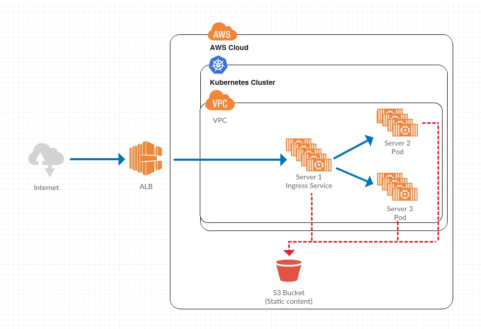

# Production Plan

The plan applied for development environment cannot be applied to production as it does not ensure availability/scalability. Deployment options for the application in production environment are below

# Server deployed in AWS EC2 Instances with multi AZ availability using ansible/CloudFormation

- This is an approach to have EC2 instances across multiple Availability Zones. 
- Load balancer can be created for the EC2 instances and secured with HTTPS at Load balancer lever using AWS ACM. 
- The approach is not suitable for this approach is that the application uses prevayler as database. Hence EBS cannot be used and EFS should be used. 
- Also the application cannot be scaled horizontally and multiple read/writes to EFS cause concurrency issues. 
- Recommendations to use this approach is to use RDBMS database and AWS RDS is a good fit with daily automated incremental snapshots.

# Web application deployed using AWS Elastic Beanstalk
- In  this approach, we can deploy the webapp directly to AWS Elastic Beanstalk and let AWS manage the capacity planning, autoscaling , availability and fault tolerance. 
- Elastic beanstalk deploys the application in EC2 instances and the problems faced in above approach is applicable here as well. 

# Docker deployed in AWS ECS service
- In this approach, we can build a docker container with the tomcat server official docker image. 
- Setup a puppet/jenkins environment and ensure CI/CD to deploy directly to AWS ECS service. 
- AWS ECS service can be launched in Fargate and EC2 Launch mode. In EC2 launch mode, autoscaling, availability should be managed manually. 
- In Fargate mode, AWS manages automatically autoscaling, availability and infrastructure. This method is a better approach than the above two methods

# AWS Kubernetes service.
- The best approach to deploy the companyNews web application is the use of AWS EKS Managed service using Kubernetes. Kubernetes has an advantage of deployment over ECS since Kubernetes is available on all major cloud platforms but ECS is available only on AWS. 
- For application monitoring, various solutions available for Kubernetes like InfluxDB, Grafana and Elasticsearch.
- Autoscaling feature is not available in Docker swarm and Kubernetes can be autoscaled vertically which perfectly fits our application’s requirement. 
- Kubernetes can be installed within a VPC in AWS which ensures security. 
- Installing a docker swarm is easy whereas Kubernetes is complex but AWS Kubernetes managed services overcomes this difficulty. Below is the architecture plan for Kubernetes.

The static content will be delivered from S3 bucket. The HTTPS support can be implemented at Load Balancer level.
